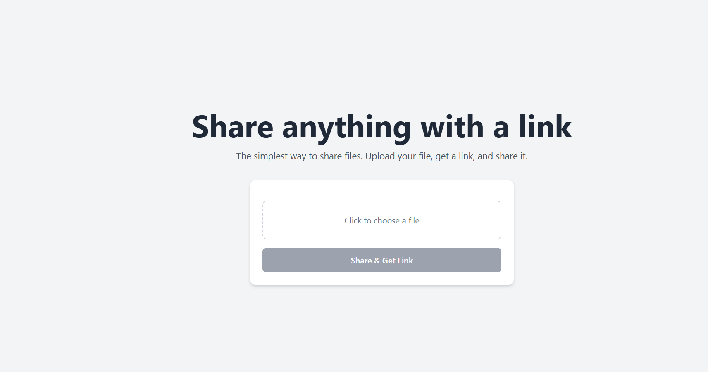
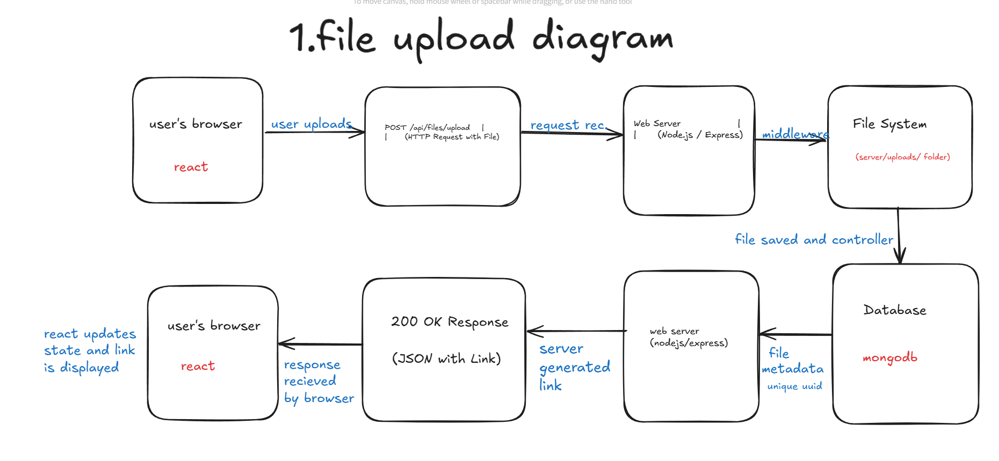
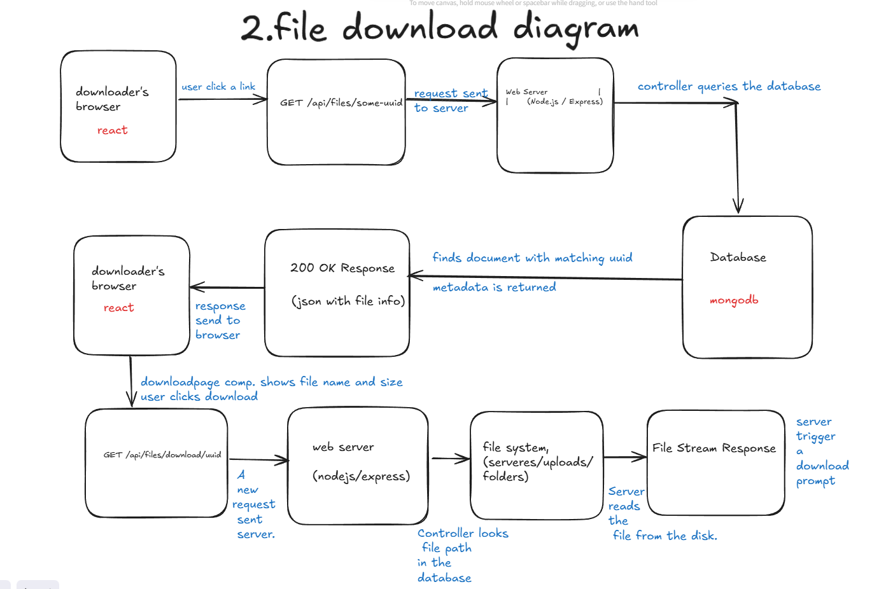

Linkify - Full stack file sharing application

A simple, fast, and private file-sharing application built with the MERN stack (MongoDB, Express.js, React, Node.js). This project allows users to upload a file and instantly receive a unique, shareable link to send to others for download.



Architecture Diagrams
The application follows a standard client-server model. The diagrams below illustrate the two primary user flows.

1. File Upload Flow



2. File Download Flow



***********************************************

Features----
*Simple User Interface: A clean, single-page interface for uploading files.

*Modern UI: Styled with Tailwind CSS for a professional and responsive design.

*Unique Link Generation: Each uploaded file generates a universally unique identifier (UUID) for a private and secure link.

*Direct Download Page: Shared links lead to a clean download page showing the file name and size, with a clear download button.

*RESTful API: A well-structured backend API to handle file uploads and data retrieval.
******************************************
Tech Stack-----

Backend (file-sharing-backend)->

Node.js: JavaScript runtime environment.

Express.js: Web framework for Node.js.

MongoDB: NoSQL database for storing file metadata.

Mongoose: Object Data Modeling (ODM) library for MongoDB.

Multer: Middleware for handling multipart/form-data, used for file uploads.

UUID: For generating unique identifiers for file links.
***********************************************
Frontend (file-sharing-frontend)->

React: JavaScript library for building user interfaces.

Parcel: Web application bundler.

Tailwind CSS: A utility-first CSS framework for styling.

React Router DOM: For client-side routing.

Axios: For making HTTP requests to the backend API.
***********************************************
Project Structure
The project uses a monorepo-like structure with two main directories: file-sharing-frontend and file-sharing-backend.

Getting Started
Prerequisites
Node.js (v18 or later recommended)--
npm (v9 or later)

MongoDB (either a local instance or a free MongoDB Atlas cluster)
***********************************************

Installation & Setup-------

1.Clone the repository:
```git clone https://github.com/your-username/your-repo-name.git
cd your-repo-name
```

2.Setup the Backend:

Navigate to the file-sharing-backend directory:
```
cd file-sharing-backend
```
Install dependencies:
```
npm install
```

Create a .env file in this directory and add your configuration:
```
PORT=8000
MONGO_URI=your_mongodb_connection_string
APP_BASE_URL=http://localhost:1234
```

Create an empty uploads folder in this directory.

3.Setup the Frontend:

Navigate to the file-sharing-frontend directory from the root:
```
cd ../file-sharing-frontend
```

Install dependencies:
```
npm install
```
Running the Application
You will need two separate terminals to run both the frontend and backend servers concurrently.

Run the Backend Server:

In one terminal, navigate to the file-sharing-backend directory and run:
```
npm run dev
``` 
```
The server should be running on http://localhost:8000.
```
Run the Frontend Server:

In a second terminal, navigate to the file-sharing-frontend directory and run:
```
npm start
```
```
The application should open in your browser at http://localhost:1234.
```
